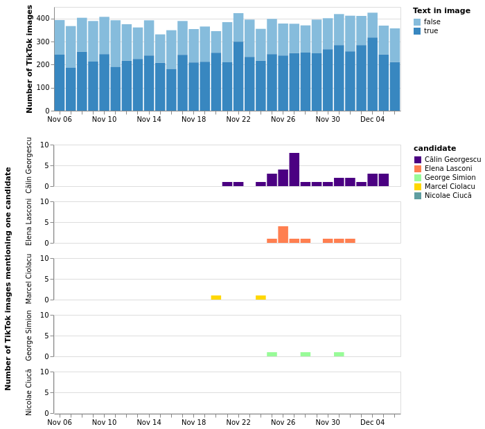

# DSA Ad Repository Data Sprint - political TikTok Romania


This project was developed as part of the February 2025 DSA Ad Datasprint organized at Sciences Po.
It explores the use of TikTok promotional contents during the Romanian presidential campaign of 2024.

The notebook `Romanian_Campain_TikTok_Ads.ipynb` contains the code to reproduce our analysis, including:
- Collecting of all promotional contents from [library.tiktok.com/other-commercial-content](https://library.tiktok.com/other-commercial-content) targeting Romania the month before the election
- Downloading the cover images of all videos
- Running Optical Character Recognition (OCR) on the images
- Searching for the names of candidates for the Presidential election in the detected texts (if the post mentions several candidates, it is excluded)
- Producing the following chart:



## Installation

To reproduce the analysis, start by cloning the repository and installing the Python dependencies listed in the `requirements.txt` file:

```bash
git clone https://github.com/medialab/dsa-sprint-romania.git
cd dsa-sprint-romania
pip install -r requirements.txt
```
## Important Notes and Limitations

- **Scope of the analysis**:
  This analysis focuses exclusively on the category labeled as **"Other Commercial Content"** from the TikTok Ad Library. It does **not** include content classified under the "Ads" category by TikTok. Therefore, the findings presented here cannot be generalized to the broader set of commercial ads on the platform.

- **Timing of the peak**:
  A noticeable peak in political content can be observed on the chart. However, this peak occurred **after the first round** of the 2024 Romanian presidential election. As a result, we cannot draw any conclusions about the influence or strategic use of TikTok commercial content on the electoral outcome.
